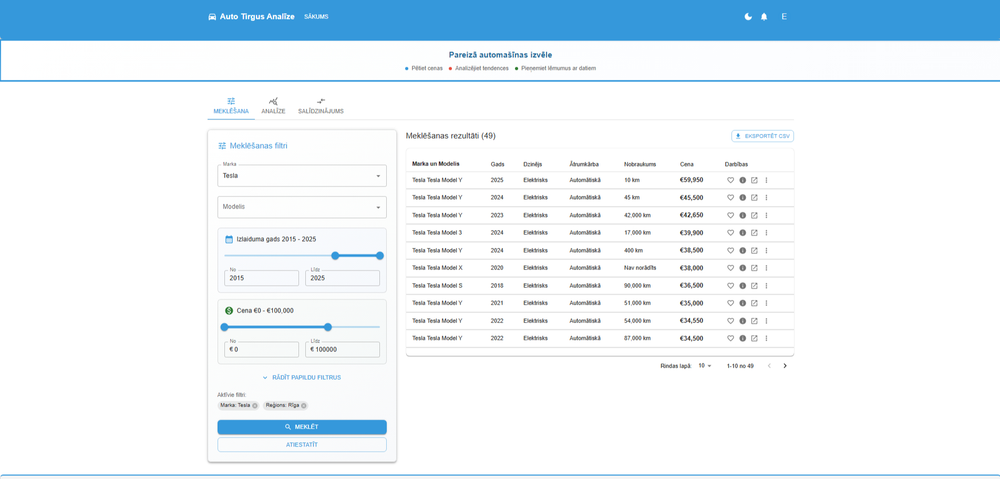
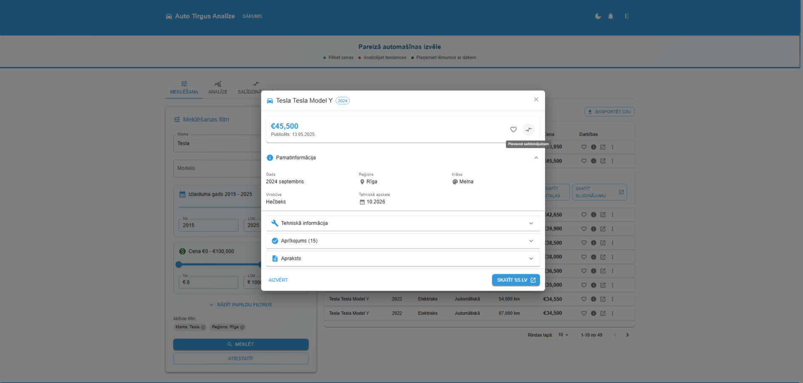
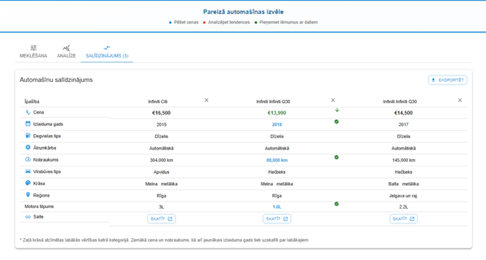
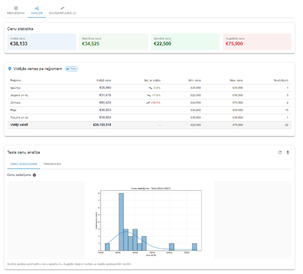

# Latvian Car Market Analysis (ss.lv)

This is a prototype project I built around the Latvian used car market.  
The idea: car hunting on ss.lv is tedious, and it’s hard to compare prices across brands, years, and regions. So I made a scraper + analysis pipeline to explore what insights could be pulled out from that limited data.

## What it does
- Scrapes live listings from **ss.lv** (or you can use the sample DB included which I recommend as it runs)
- Cleans and stores the data in SQLite
- Provides a small **Flask API** + **React UI** to browse and compare cars
- Generates analysis charts for:
  - average price by brand
  - depreciation vs model year
  - regional differences in median price

## Tech stack
- **Backend**: Python (Flask, SQLAlchemy, pandas, BeautifulSoup)
- **Storage**: SQLite
- **Frontend**: React + Chart.js
- **Viz for README**: matplotlib (PNG charts)

## How to run

### 1. Scraper (simplest entry point)
If you just want to grab some listings and see raw data(and ss.lv hasnt changed their html :D):
python ss_scraper.py
This will fetch data and save it into the SQLite database.

## 2. Backend API
```bash
python -m venv .venv && source .venv/bin/activate
pip install -r requirements.txt

# set up env
cp .env.example .env
# edit if needed (JWT_SECRET, CAR_PRICE_DB_URL, etc.)

# run API
export FLASK_APP=api.py
flask run

## 3. Frontend
```bash
npm install
npm start

## Demo data
For convenience, the SQLite DB already has a snapshot of listings in a specific date in time a bit back in time so you don’t have to scrape to try it.

## Example API routes
- `POST /api/search` → filter by brand/year/fuel  
- `GET /api/regions` → list all supported regions  
- `GET /api/region-stats` → median prices by region  
- `GET /api/charts/price-trend?brand=BMW&model=3%20Series`  
- `GET /api/charts/price-distribution`

## Screenshots
- **Listings**  
  

- **Listing details**  
  

- **Comparing cars**  
  

- **Regional analysis**  
  

## Limitations
- Only tested on a subset of brands at this time, as It was my first 'big' project for me and It already took a long time, plus was a school,free time project. Wanted to try scraping without outright overloading the website,
- Scraper depends on ss.lv markup (fragile if they change HTML)  
- Deduplication/model cleanup is basic  
- Next steps would be: broaden brand coverage, add retries, improve schema with migrations, and explore popularity trends over time